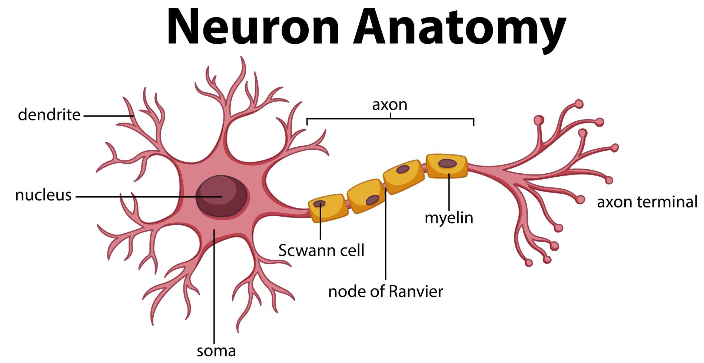
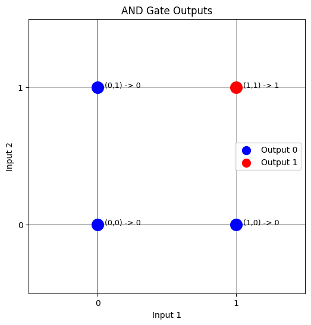
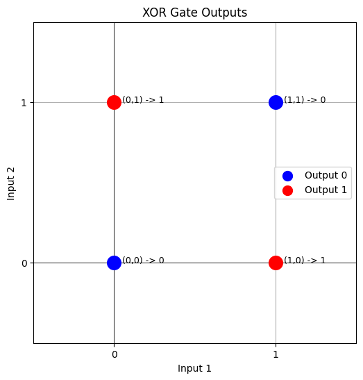
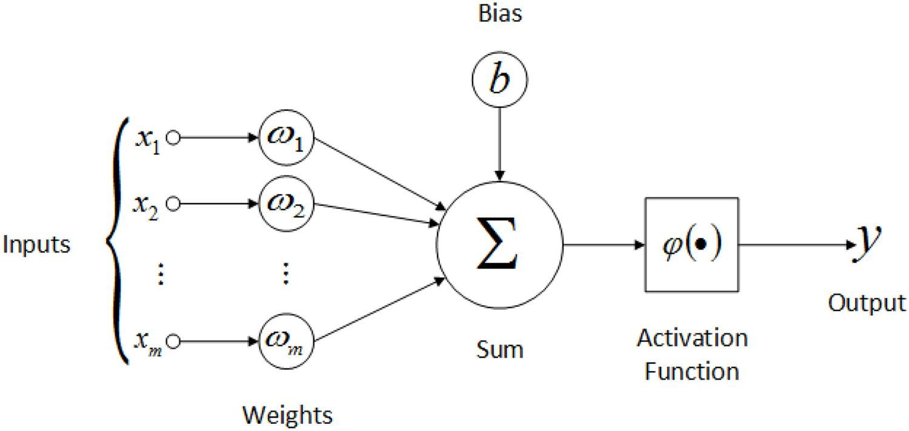
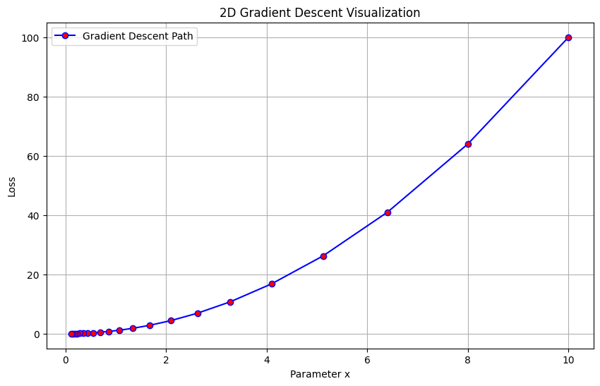
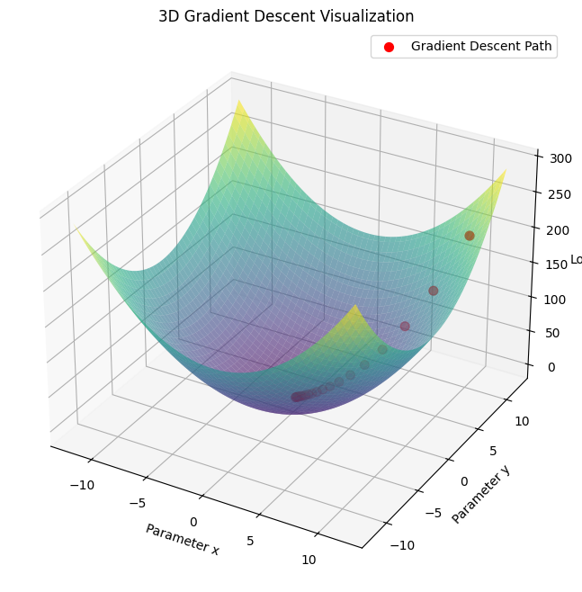

# Introduction to Neural Networks: From Biology to Computation

**Goal:** To understand the basic building blocks of neural networks, how they are inspired by the brain, what simple computations they can perform, their limitations, and the fundamental concepts behind how they learn.

**Table of Contents:**

1.  **Inspiration:** The Biological Neuron
2.  **The Basic Unit:** The Artificial Neuron (Perceptron)
3.  **Simple Computations:** Modeling Logic Gates (AND, OR, NOT)
4.  **The Wall:** Linear Separability and the XOR Problem
5.  **Building Bigger Brains:** Multi-Layer Perceptrons (MLPs)
6.  **How Networks Learn:** Forward and Backward Passes
    *   Forward Pass: Making Predictions
    *   Backward Pass: Learning from Mistakes (Backpropagation & Gradient Descent)
    *   Visualizing Learning: Gradient Descent Examples
7.  **Key Terminology Recap**
8.  **Further Exploration (Links)**

---

## 1. Inspiration: The Biological Neuron

Our journey into Artificial Neural Networks begins with their inspiration: the human brain. The brain is an incredibly complex network of billions of cells called **neurons**.

*   **How they work (simplified):** Neurons receive signals from sensory organs or other neurons through input branches called **dendrites**. These signals are processed in the cell body (containing the **nucleus**). If the combined signal is strong enough, the neuron "fires," sending an output signal down its **axon** to other connected neurons.
*   **The Power of Connection:** It's not just individual neurons, but the vast network of connections and their strengths that enable learning, pattern recognition, and complex thought.



*(Image: Diagram of a biological neuron showing dendrites, nucleus, and axon)*

Artificial Neural Networks (ANNs) try to mimic this structure and process computationally.

---

## 2. The Basic Unit: The Artificial Neuron (Perceptron)

The simplest form of an ANN is based on a single artificial neuron. One of the earliest models (from the 1950s!) is called the **Perceptron**. Think of it as a simplified computational model of a biological neuron.


*(Image: Diagram of a Perceptron showing inputs, weights, summation, activation function, and output)*

**How it works:**

1.  **Inputs (like Dendrites):** The perceptron receives one or more input values (`x1`, `x2`, ..., `xn`). These could represent features of your data (e.g., pixels in an image, values from a sensor).
2.  **Weights (Synapse Strength):** Each input connection has a weight (`w1`, `w2`, ..., `wn`). Weights represent the *strength* or *importance* of an input. A positive weight might excite the neuron, while a negative weight might inhibit it. These weights are what the network *learns*.
3.  **Summation:** The perceptron computes the *weighted sum* of its inputs: `Sum = (x1 * w1) + (x2 * w2) + ... + (xn * wn)`. Often, an additional term called **bias** (`b`) is added to this sum. The bias acts like an offset, making it easier for the neuron to activate or not. Think of it as shifting the activation threshold. `Weighted Sum = Sum + b`.
4.  **Activation Function (like Nucleus Firing):** The weighted sum is passed through an **activation function**. The *original* Perceptron used a simple **step function**:
    *   If the `Weighted Sum` is above a certain `threshold`, the neuron outputs 1 ("fires").
    *   Otherwise, it outputs 0 ("does not fire").
    *   (Note: Including the bias `b` allows us to simplify this to checking if `Weighted Sum > 0`).
5.  **Output (like Axon Signal):** The result of the activation function is the final output of the perceptron.

In essence, a perceptron takes multiple inputs, weights their importance, sums them up, and decides whether to activate based on a threshold.

---

## 3. Simple Computations: Modeling Logic Gates (AND, OR, NOT)

Even a single perceptron can perform simple computations. Let's see how it can model basic logical functions, much like transistors form logic gates in traditional computers.

We can implement a perceptron in Python:

```python
import numpy as np

def perceptron(inputs, weights, bias): # Using bias instead of threshold
    """Calculates the output of a simple perceptron."""
    # Ensure inputs and weights match
    assert len(inputs) == len(weights)

    # Calculate weighted sum
    weighted_sum = np.dot(inputs, weights) + bias # np.dot handles multiplication and sum

    # Apply step activation function
    if weighted_sum >= 0: # Threshold is effectively 0 due to bias
        return 1
    else:
        return 0
```

**Let's model Logic Gates:**

*   **OR Gate:** Outputs 1 if *any* input is 1.
    | Input 1 | Input 2 | Output |
    | :------ | :------ | :----- |
    | 0       | 0       | 0      |
    | 0       | 1       | 1      |
    | 1       | 0       | 1      |
    | 1       | 1       | 1      |

    ```python
    # OR Example (Weights [1, 1], Bias -0.5)
    weights_or = [1.0, 1.0]
    bias_or = -0.5
    inputs = [[0,0], [0,1], [1,0], [1,1]]
    print("--- OR Gate ---")
    for input_pair in inputs:
        output = perceptron(input_pair, weights_or, bias_or)
        print(f"Input: {input_pair}, Output: {output}")
    # Try working out why these weights/bias work!
    # e.g., [1,1]: (1*1.0 + 1*1.0) - 0.5 = 1.5 >= 0 -> Output 1
    # e.g., [0,0]: (0*1.0 + 0*1.0) - 0.5 = -0.5 < 0 -> Output 0
    ```

*   **AND Gate:** Outputs 1 only if *all* inputs are 1.
    | Input 1 | Input 2 | Output |
    | :------ | :------ | :----- |
    | 0       | 0       | 0      |
    | 0       | 1       | 0      |
    | 1       | 0       | 0      |
    | 1       | 1       | 1      |

    ```python
    # AND Example (Weights [1, 1], Bias -1.5)
    weights_and = [1.0, 1.0]
    bias_and = -1.5
    inputs = [[0,0], [0,1], [1,0], [1,1]]
    print("\n--- AND Gate ---")
    for input_pair in inputs:
        output = perceptron(input_pair, weights_and, bias_and)
        print(f"Input: {input_pair}, Output: {output}")
    # e.g., [1,1]: (1*1.0 + 1*1.0) - 1.5 = 0.5 >= 0 -> Output 1
    # e.g., [1,0]: (1*1.0 + 0*1.0) - 1.5 = -0.5 < 0 -> Output 0
    ```

*   **NOT Gate:** Inverts the input. (Requires only one input).
    | Input 1 | Output |
    | :------ | :----- |
    | 0       | 1      |
    | 1       | 0      |

    ```python
    # NOT Example (Weight [-1], Bias 0.5) - Note: Input needs to be a list/array
    weights_not = [-1.0]
    bias_not = 0.5
    inputs = [[0], [1]] # List of single inputs
    print("\n--- NOT Gate ---")
    for input_val in inputs:
        output = perceptron(input_val, weights_not, bias_not)
        print(f"Input: {input_val}, Output: {output}")
    # e.g., [0]: (0*-1.0) + 0.5 = 0.5 >= 0 -> Output 1
    # e.g., [1]: (1*-1.0) + 0.5 = -0.5 < 0 -> Output 0
    ```

These examples show that by choosing appropriate weights and biases, a single perceptron can represent simple linear decision boundaries.

---

## 4. The Wall: Linear Separability and the XOR Problem

The perceptron seemed promising, but researchers quickly hit a wall. Look at the inputs and outputs for AND and OR on a graph:



*(Image: Graph showing points for AND or OR, separable by a single straight line)*

You can draw a single straight line to separate the inputs that result in output 0 from those that result in output 1. Problems where this is possible are called **linearly separable**. Perceptrons are great at solving these!

**But what about the XOR (Exclusive OR) gate?** XOR outputs 1 if the inputs are *different*, and 0 if they are the *same*.

| Input 1 | Input 2 | Output |
| :------ | :------ | :----- |
| 0       | 0       | 0      |
| 0       | 1       | 1      |
| 1       | 0       | 1      |
| 1       | 1       | 0      |

Now, try plotting these points:



*(Image: Graph showing points for XOR, impossible to separate 0s and 1s with one line)*

**Challenge:** Try drawing *one single straight line* to separate the red dots (output 1) from the blue dots (output 0). You can't!

This is a **non-linearly separable** problem. A single perceptron, because it fundamentally defines a linear boundary, **cannot solve the XOR problem**. This discovery in the 1960s (highlighted in the book "Perceptrons" by Minsky and Papert) led to a significant decline in ANN research funding, sometimes called the "AI Winter".

**Key Takeaway:** Single perceptrons are limited to problems where the different classes can be separated by a straight line (or a flat plane in higher dimensions). Real-world data is often much more complex.

---

## 5. Building Bigger Brains: Overcoming Limitations with Multi-Layer Networks (MLPs)

We saw that a single, original Perceptron hits a wall with non-linearly separable problems like XOR. How do we overcome this? By connecting neurons together in layers, creating a network architecture.

The standard name for such a network is the **Multi-Layer Perceptron (MLP)**.

> [!IMPORTANT]  
> While the name includes "Perceptron," it's crucial to understand that the neuron units used in the hidden and output layers of *modern* MLPs are **not** the same as the original single-layer Perceptron with its simple step function.

Think of MLPs as an evolution:

1.  **Multiple Layers:** An MLP has at least three layers:
    *   **Input Layer:** Receives the initial data.
    *   **Hidden Layer(s):** One or more layers of neurons between the input and output. These are the workhorses that learn complex patterns and representations. Their presence is key to handling non-linearity.
    *   **Output Layer:** Produces the final result.

2.  **Advanced Neurons (Beyond the Basic Perceptron):** The neurons within the hidden and output layers use more sophisticated **activation functions** instead of the simple step function. Common choices include:
    *   **Sigmoid:** Squashes values into a range between 0 and 1. `output = 1 / (1 + exp(-input))`
    *   **Tanh (Hyperbolic Tangent):** Squashes values into a range between -1 and 1.
    *   **ReLU (Rectified Linear Unit):** Outputs the input if positive, and 0 otherwise (`output = max(0, input)`). Very common in deep learning.


*(Image: Diagram showing a neuron suitable for MLP layers - multiple inputs, weights, bias, a non-linear activation function (like Sigmoid/ReLU/Tanh), and an output)*

**Why This Matters:**

*   **Non-Linearity:** The combination of *multiple layers* and *non-linear activation functions* is what gives MLPs their power. It allows them to learn complex, curved decision boundaries, essential for solving problems like XOR and many real-world tasks (image recognition, natural language processing, etc.). Without non-linear activations, an MLP would mathematically collapse into an equivalent single-layer network, losing its advantage.

**In Summary:** Call the architecture an **MLP**, but remember it's built from layers of *modern artificial neurons* (with non-linear activations) that are more capable than the original Perceptron definition. This structure allows MLPs to model intricate, non-linear relationships in data.


---

## 6. How Networks Learn: Forward and Backward Passes

Okay, we have this structure (an MLP). But how does it *learn* the right weights and biases to solve a problem like classifying images or predicting house prices? This happens through a training process involving two key phases: the **Forward Pass** and the **Backward Pass**.

Imagine we have some training data (inputs and the correct expected outputs).

### Forward Pass: Making Predictions

This is the process of feeding an input through the network to get an output or prediction.

1.  The input data is presented to the **input layer**.
2.  The data flows layer by layer through the network:
    *   At each neuron in a layer, the weighted sum of its inputs (from the previous layer) plus its bias is calculated.
    *   The result is passed through the neuron's activation function.
    *   The outputs of this layer become the inputs for the next layer.
3.  This continues until the data reaches the **output layer**, which produces the network's final prediction.

Essentially, the forward pass is just calculating the network's output for a given input, using the *current* weights and biases. Initially, these weights are random, so the predictions will be poor.

### Backward Pass: Learning from Mistakes (Backpropagation & Gradient Descent)

This is where the magic of learning happens. We compare the network's prediction (from the forward pass) with the *correct* output from our training data. The difference is the **error** (or **loss**). The goal is to adjust the weights and biases to reduce this error.

1.  **Calculate the Error:** Measure how far off the prediction was using a **loss function** (e.g., Mean Squared Error, Cross-Entropy).
2.  **Backpropagation (Finding the Blame):** This is the core algorithm for figuring out *how much each weight and bias in the entire network contributed* to the final error. It uses the chain rule from calculus to efficiently calculate the **gradient** (slope) of the loss function with respect to each parameter (weight/bias). Think of the gradient as the direction of steepest increase in the error – we want to go in the *opposite* direction.
3.  **Gradient Descent (Updating the Weights):** Once we know how much each weight/bias contributed to the error (the gradients), we update them to reduce the error. The simplest update rule is:
    *   `new_weight = old_weight - learning_rate * gradient_of_error_wrt_weight`
    *   `new_bias = old_bias - learning_rate * gradient_of_error_wrt_bias`
    The **learning rate** is a small hyperparameter (a setting you choose before training) that controls how big the update steps are. Too large, and you might overshoot the minimum error; too small, and learning will be very slow.

**The Cycle:** We repeat the Forward Pass and Backward Pass for many inputs in our training data, iteratively adjusting the weights and biases. Over time, the network "descends" the "hill" of the loss function, hopefully finding a set of weights and biases that produce low error and make good predictions.

### Visualizing Learning: Gradient Descent Examples

Gradient descent is like trying to find the bottom of a valley blindfolded. You feel the slope (gradient) beneath your feet and take a step downhill.

**2D Example:** Imagine optimizing one parameter (`x`) to minimize a loss function (`loss = x^2`).

```python
#import numpy as np # Already imported
import matplotlib.pyplot as plt

# Define the loss function (example: quadratic function)
def loss_function(x):
    return x**2

# Gradient descent function
def gradient_descent_2d(learning_rate, epochs):
    x = 10  # Start at a random point
    x_values, loss_values = [x], [loss_function(x)] # History tracking
    for _ in range(epochs):
        gradient = 2 * x  # Derivative (slope) of x^2 is 2x
        x = x - learning_rate * gradient  # Move opposite to gradient
        x_values.append(x)
        loss_values.append(loss_function(x))
    return x_values, loss_values

# Parameters
learning_rate = 0.1
epochs = 20
x_vals, loss_vals = gradient_descent_2d(learning_rate, epochs)

# Plotting
plt.figure(figsize=(10, 6))
x_curve = np.linspace(-11, 11, 100)
y_curve = loss_function(x_curve)
plt.plot(x_curve, y_curve, 'g-', label='Loss Function (x^2)') # Green line for the function curve
plt.plot(x_vals, loss_vals, 'r-o', label='Gradient Descent Path') # Red line and circles for steps
plt.title('2D Gradient Descent Visualization')
plt.xlabel('Parameter x')
plt.ylabel('Loss')
plt.grid(True)
plt.legend()
plt.show()
```


*(Image: 2D plot showing the quadratic loss curve and steps taken by gradient descent towards the minimum)*

**3D Example:** Optimizing two parameters (`x`, `y`) to minimize `loss = x^2 + y^2`.

```python
from mpl_toolkits.mplot3d import Axes3D

# Define the loss function (example: quadratic function in 3D)
def loss_function_3d(x, y):
    return x**2 + y**2

# Gradient descent function in 3D
def gradient_descent_3d(learning_rate, epochs):
    x, y = 10, 10  # Initial guesses
    x_vals, y_vals, loss_vals = [x], [y], [loss_function_3d(x, y)]
    for _ in range(epochs):
        gradient_x = 2 * x  # Partial derivative w.r.t x
        gradient_y = 2 * y  # Partial derivative w.r.t y
        x = x - learning_rate * gradient_x # Update x
        y = y - learning_rate * gradient_y # Update y
        x_vals.append(x); y_vals.append(y); loss_vals.append(loss_function_3d(x, y))
    return x_vals, y_vals, loss_vals

# Parameters
learning_rate = 0.1
epochs = 20
x_vals, y_vals, loss_vals = gradient_descent_3d(learning_rate, epochs)

# Create meshgrid for 3D plot surface
X, Y = np.meshgrid(np.linspace(-12, 12, 100), np.linspace(-12, 12, 100))
Z = loss_function_3d(X, Y)

# Plot
fig = plt.figure(figsize=(12, 8))
ax = fig.add_subplot(111, projection='3d')
ax.plot_surface(X, Y, Z, cmap='viridis', alpha=0.6, label='Loss Surface (x^2 + y^2)')
ax.plot(x_vals, y_vals, loss_vals, 'r-o', markersize=5, label='Gradient Descent Path') # Plot path
ax.set_title('3D Gradient Descent Visualization')
ax.set_xlabel('Parameter x'); ax.set_ylabel('Parameter y'); ax.set_zlabel('Loss')
# Creating a proxy artist for the legend entry of the surface plot
import matplotlib.lines as mlines
surface_proxy = mlines.Line2D([], [], color='viridis', marker='_', markersize=15, linestyle='None')
ax.legend([surface_proxy, ax.get_lines()[0]], ['Loss Surface', 'Gradient Descent Path'])
plt.show()

```


*(Image: 3D plot showing the bowl-shaped loss surface and the steps taken by gradient descent moving down towards the minimum)*

These visualizations show how the iterative process adjusts parameters to find the lowest point in the loss landscape.

---

## 7. Key Terminology Recap

*   **Neuron / Artificial Neuron:** Basic computational unit in an ANN.
*   **Perceptron:** An early, simple model of an artificial neuron using a step activation function. Limited to linearly separable problems.
*   **Weights & Biases:** Parameters the network learns. Weights determine input importance; bias shifts the activation threshold.
*   **Activation Function:** Introduces non-linearity (e.g., Step, Sigmoid, ReLU). Applied after the weighted sum.
*   **Linear Separability:** Property of problems where classes can be divided by a single straight line/plane.
*   **XOR Problem:** Classic example of a non-linearly separable problem.
*   **Multi-Layer Perceptron (MLP):** A network with input, hidden, and output layers. Can solve non-linear problems.
*   **Forward Pass:** Process of feeding input through the network to get a prediction.
*   **Backward Pass:** Process of calculating error and updating weights/biases.
    *   **Loss Function:** Measures the error between prediction and target.
    *   **Backpropagation:** Algorithm to calculate gradients (how much each parameter contributed to the error).
    *   **Gradient Descent:** Algorithm to update parameters to minimize loss, using gradients.
*   **Learning Rate:** Hyperparameter controlling the step size during gradient descent.

---

## 8. Further Exploration

This was just a brief introduction! There's much more to learn. Here are some resources:

- **Interactive Playground:** [TensorFlow Playground](https://playground.tensorflow.org/) - Visualize how different network structures and parameters affect learning.
- [More on Perceptrons](https://humphryscomputing.com/Notes/Neural/single.neural.html)
- **Alternative Introduction:** [UW Madison Data Science Course Notes](https://uw-madison-datascience.github.io/2022-10-26-machine-learning-novice-sklearn/06-neural-networks/index.html)


---

<details>
<summary>Python Code for AND and XOR Data Visualization</summary>


Here's the Python code using Matplotlib to generate the scatter plots for the AND and XOR data points:

```python
import matplotlib.pyplot as plt
import numpy as np

# Define the input points (corners of the unit square)
inputs = np.array([[0, 0], [0, 1], [1, 0], [1, 1]])
x_coords = inputs[:, 0] # First column (Input 1)
y_coords = inputs[:, 1] # Second column (Input 2)

# Define the outputs for AND and XOR
outputs_and = np.array([0, 0, 0, 1])
outputs_xor = np.array([0, 1, 1, 0])

# Define colors for visualization (e.g., blue for 0, red for 1)
colors = ['blue', 'red']

# --- Plotting AND Gate ---
plt.figure(figsize=(6, 6))
plt.title('AND Gate Outputs')
plt.xlabel('Input 1')
plt.ylabel('Input 2')

# Plot points based on their output class
for i in range(len(inputs)):
    plt.scatter(x_coords[i], y_coords[i],
                color=colors[outputs_and[i]], # Color determined by AND output
                s=200, # Size of points
                zorder=3) # Plot points on top of gridlines

# Add text labels for clarity (optional)
for i in range(len(inputs)):
    plt.text(x_coords[i] + 0.05, y_coords[i], f'({x_coords[i]},{y_coords[i]}) -> {outputs_and[i]}', fontsize=9)

# Customize plot appearance
plt.xticks([0, 1])
plt.yticks([0, 1])
plt.xlim(-0.5, 1.5)
plt.ylim(-0.5, 1.5)
plt.grid(True, zorder=0) # Grid behind points
plt.axhline(0, color='black', linewidth=0.5)
plt.axvline(0, color='black', linewidth=0.5)

# Create legend handles manually
legend_handles = [plt.scatter([], [], color='blue', s=100, label='Output 0'),
                  plt.scatter([], [], color='red', s=100, label='Output 1')]
plt.legend(handles=legend_handles, loc='center right')

plt.show()


# --- Plotting XOR Gate ---
plt.figure(figsize=(6, 6))
plt.title('XOR Gate Outputs')
plt.xlabel('Input 1')
plt.ylabel('Input 2')

# Plot points based on their output class
for i in range(len(inputs)):
    plt.scatter(x_coords[i], y_coords[i],
                color=colors[outputs_xor[i]], # Color determined by XOR output
                s=200,
                zorder=3)

# Add text labels for clarity (optional)
for i in range(len(inputs)):
     plt.text(x_coords[i] + 0.05, y_coords[i], f'({x_coords[i]},{y_coords[i]}) -> {outputs_xor[i]}', fontsize=9)


# Customize plot appearance
plt.xticks([0, 1])
plt.yticks([0, 1])
plt.xlim(-0.5, 1.5)
plt.ylim(-0.5, 1.5)
plt.grid(True, zorder=0)
plt.axhline(0, color='black', linewidth=0.5)
plt.axvline(0, color='black', linewidth=0.5)

# Reuse legend handles from above
plt.legend(handles=legend_handles, loc='center right')

plt.show()
```

This code will generate two separate plots:

1.  **AND Plot:** Shows the four input points, colored according to the AND output ( (1,1) will be red, the others blue). You can clearly see these points *are* linearly separable.
2.  **XOR Plot:** Shows the four input points, colored according to the XOR output ( (0,1) and (1,0) will be red, (0,0) and (1,1) will be blue). This visually demonstrates the non-linear separability challenge.

</details>


<!-- 
- https://carpentries-incubator.github.io/machine-learning-novice-sklearn/07-neural-networks/index.html
- Practical NN with Scikit-Learn:** [Stack Abuse Tutorial](https://stackabuse.com/introduction-to-neural-networks-with-scikit-learn/) 
-->
